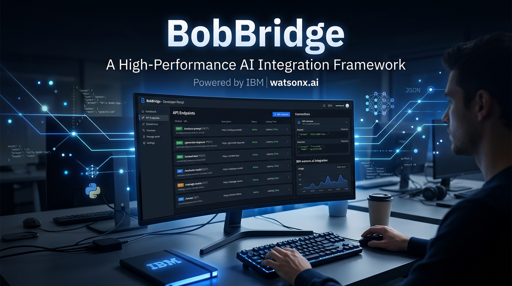

# BobBridge

> Development accelerated. Describe an endpoint, get a live mock URL and a Bob-ready code scaffold instantly — in your language of choice.



**Dynamic Framework Display**: The hero section features an animated typing effect that cycles through all 9 supported frameworks, showcasing the multi-language capabilities.

**Built by IBM Bob** for the lablab.ai IBM Bob hackathon (May 15–17, 2026).

## What it does

Plain-English prompt → IBM watsonx.ai (Granite/Llama/Mistral models) → strict-JSON contract → in-memory mock served at `/api/mock/{id}` + framework-specific code scaffold + ready-to-paste IBM Bob prompt.

**The thesis:** BobBridge produces the contract; IBM Bob (a VS Code fork with AI capabilities, similar to Antigravity) implements the system.

## Supported Languages & Frameworks

BobBridge now supports **9 programming languages** with their most popular frameworks:

- ☕ **Java** - Spring Boot 3
- 🐍 **Python** - FastAPI
- 📜 **JavaScript** - Express.js
- 📘 **TypeScript** - NestJS
- 🐹 **Go** - Gin
- 🦀 **Rust** - Axum
- #️⃣ **C#** - ASP.NET Core
- 🐘 **PHP** - Laravel
- 💎 **Ruby** - Rails

## Key Features

- 🌍 **Multi-Language Support**: Generate code in 9 popular languages with framework-specific implementations
- 🎨 **IBM Branding**: Official IBM Blue color palette, IBM watsonx.ai logo, and design language throughout
- 🤖 **IBM Bob Integration**: Dedicated handoff section with "Launch IBM Bob" and "Download IBM Bob" buttons
- 🔒 **Input Guardrails**: Prevents generation of sensitive content (passwords, SQL queries, etc.)
- 📐 **2-Column Layout**: Mock result and Bob handoff displayed side-by-side on larger screens
- 🌐 **Region Display**: Shows geographic region (e.g., us-south) for API endpoints
- 💡 **AI Tips Banner**: Rotating educational tips about features and best practices
- ⚡ **Smart Auto-scroll**: Automatically scrolls to results with manual scroll adjustment
- 🎯 **Model Selection**: Choose from 6 AI models (Granite, Llama, Mistral)
- 📊 **Enhanced Results**: Display model used, language, and region information
- 🎨 **Syntax Highlighting**: Language-specific code highlighting for all supported languages

## Quick start

```bash
cp .env.example .env.local   # fill in WATSONX_API_KEY, WATSONX_PROJECT_ID, WATSONX_URL
npm install
npm run dev
```

Open http://localhost:3000.

## Demo prompt

> Create an endpoint to fetch user order history with item name, price, and status.

## Known limitations (hackathon scope)

- Mock storage is an in-memory `Map` per function instance — a cold start wipes everything. Fine for demo, swap to Upstash Redis for production.
- No auth, no rate limiting, no persistence across deployments.

## Architecture

See `docs/superpowers/specs/2026-05-17-bobbridge-design.md`.

## Tech Stack

- **Framework**: Next.js 16 (App Router, TypeScript)
- **Runtime**: Node 22+ on Vercel
- **Styling**: Tailwind CSS + shadcn/ui with IBM Blue color palette
- **AI**: `@ibm-cloud/watsonx-ai` Node SDK
- **Models**: Multiple options including Granite, Llama 3.2/3.3/4, Mistral
- **Auth**: IBM Cloud IAM API key
- **Storage**: In-memory `Map<string, MockEntry>`
- **Code highlighting**: `prism-react-renderer`
- **ID generation**: `nanoid`
- **JSON robustness**: `jsonrepair`

## UI Components

- **TypingAnimation**: Dynamic typing animation cycling through all 9 supported frameworks with IBM gradient styling
- **AITipsBanner**: Rotating educational tips with pause on hover
- **BobHandoffSection**: Dedicated section for IBM Bob integration with 2-column layout
- **ResultPanel**: Enhanced with region and model information
- **PromptForm**: Model selector with input validation and guardrails
- **ThemeToggle**: Dark/light mode with IBM branding
- **IBMWatsonxLogo**: IBM watsonx.ai logo component for branding

## Project Structure

```
BobBridge/
├── app/
│   ├── layout.tsx
│   ├── page.tsx                      # main UI with IBM branding
│   ├── globals.css                   # IBM Blue color palette
│   └── api/
│       ├── generate/route.ts         # POST: prompt → result (with region info)
│       └── mock/[id]/route.ts        # GET/POST/PUT/DELETE/OPTIONS
├── components/
│   ├── typing-animation.tsx          # Dynamic framework typing animation
│   ├── ai-tips-banner.tsx            # Rotating tips banner
│   ├── bob-handoff-section.tsx       # Dedicated Bob integration
│   ├── prompt-form.tsx               # Model selector
│   ├── result-panel.tsx              # Enhanced with region display
│   ├── code-block.tsx
│   ├── theme-toggle.tsx
│   └── ui/                           # shadcn primitives
├── lib/
│   ├── watsonx.ts                    # IAM token + textChat wrapper
│   ├── prompt.ts                     # language-aware system prompts
│   ├── parse.ts                      # robust JSON extraction
│   ├── store.ts                      # in-memory Map
│   ├── bob-handoff.ts                # language-aware Bob prompt generator
│   ├── types.ts                      # shared types (with language support)
│   ├── validation.ts                 # input validation and guardrails
│   ├── env.ts                        # environment validation
│   └── utils.ts                      # cn helper
├── scripts/
│   ├── smoke.ps1                     # PowerShell smoke test
│   └── smoke.sh                      # Bash smoke test
├── docs/
│   └── superpowers/
│       ├── plans/
│       └── specs/
├── .env.example
└── README.md
```

## Development

```bash
# Install dependencies
npm install

# Run dev server
npm run dev

# Build for production
npm run build

# Start production server
npm start

# Lint
npm run lint
```

## Testing

Run the smoke test script to verify the API layer:

```powershell
# PowerShell
./scripts/smoke.ps1
```

```bash
# Bash
./scripts/smoke.sh
```

## Deployment

Deploy to Vercel:

```bash
vercel
```

Set environment variables in Vercel dashboard or CLI:
- `WATSONX_API_KEY`
- `WATSONX_PROJECT_ID`
- `WATSONX_URL`
- `WATSONX_MODEL_ID` (optional, defaults to `ibm/granite-3-3-8b-instruct`)

## UI Redesign Features

### IBM Branding
- Official IBM Blue color palette (#0f62fe and variants)
- IBM gradient effects on buttons and text
- Consistent IBM design language throughout
- IBM watsonx.ai and IBM Bob attribution

### Enhanced User Experience
- **Rotating AI Tips**: Educational banner with 10 tips, auto-rotating every 6 seconds
- **Auto-scroll**: Automatically scrolls to results after generation
- **Region Display**: Shows watsonx.ai region (e.g., us-south) for transparency
- **Model Information**: Displays which AI model was used for generation
- **Dedicated Bob Section**: Prominent handoff area with action buttons
- **Professional Terminology**: Replaced "unblock team" with "Generate Mock & Contract"

### IBM Bob Integration
- "Launch IBM Bob" button (opens IBM Bob application)
- "Download IBM Bob" button (links to IBM Bob repository)
- Clear explanation that IBM Bob is a VS Code fork with AI capabilities
- 2-column layout with sticky positioning on larger screens
- Auto-scroll with manual scroll adjustment
- Copy-paste ready prompts for seamless handoff

### Input Validation & Security
- Comprehensive input guardrails to prevent sensitive content generation
- Blocks passwords, credentials, SQL queries, system commands
- Validates prompt length and content
- Real-time validation feedback with clear error messages

## Credits

**Built by IBM Bob** - A VS Code fork with AI capabilities (similar to Antigravity) that helped create this entire application, including:
- Architecture and design
- Full-stack implementation (Next.js, TypeScript, React)
- UI/UX improvements with IBM branding and watsonx.ai logo
- Integration with IBM watsonx.ai
- Input validation and security guardrails
- 2-column responsive layout with smart scrolling
- Comprehensive documentation and testing
- UI redesign with rotating tips banner and Bob handoff section

## License

MIT